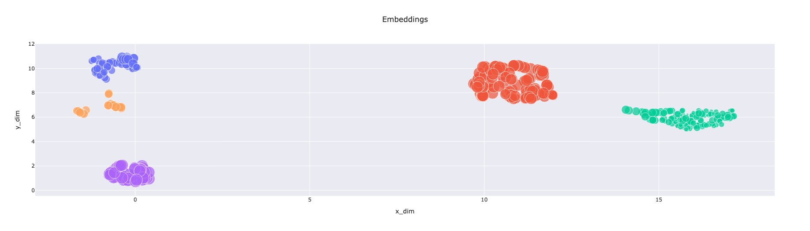
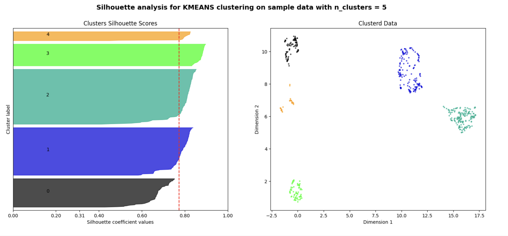
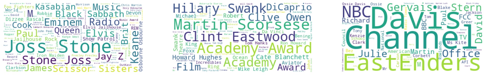
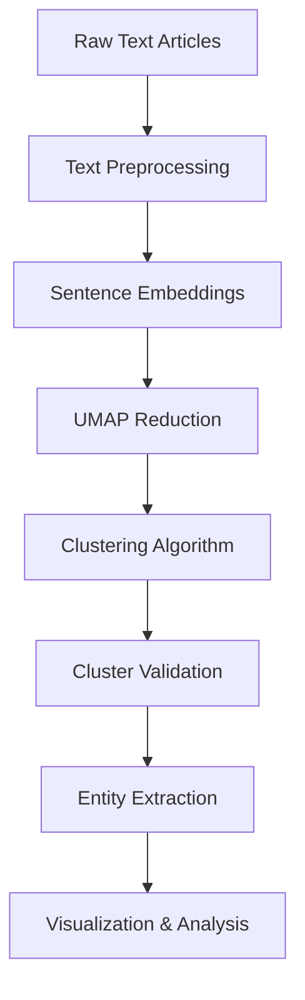

# News Article Clustering & Analysis


This repository explores the use of Natural Language Processing to analyze news articles. This involves classifying articles into different categories and sub-categories, entity recognition to extract media personalities and their jobs, and retrieving details of upcoming or concluded events. 

Considering this task is niche with access to large volume of news corpus, this project aims to optimize small language models that can fit into consumer hardware (GPU and CPU) with practical latency and throughput.

## 🎯 OBJECTIVES

- ✅ **Clustering to identify article categories and sub-categories** *(Current Implementation)*
- 🔄 **Entity Recognition to identify media personalities and their jobs** *(In Progress)*
- 📋 **Key Event Summary** *(Planned)*
- ⚡ **Lightweight Inference Pipeline for local serving** *(Planned)*
- 📊 **Accuracy Evaluation and Performance Benchmark** *(Planned)*
- 🚀 **API Service** *(Planned)*
- 🖥️ **Frontend Client** *(Planned)*

## 🔬 METHODOLOGY

### Current Implementation: Unsupervised Clustering Pipeline

The current implementation focuses on **unsupervised clustering** of news articles to automatically discover categories and sub-categories. The pipeline consists of several key components:

#### 1. **Text Embedding**
- **Model**: `all-mpnet-base-v2` (SentenceTransformers)
- **Alternative**: `Qwen/Qwen3-Embedding-0.6B`
- **Purpose**: Convert raw text articles into dense vector representations

#### 2. **Dimensionality Reduction**
- **Algorithm**: UMAP (Uniform Manifold Approximation and Projection)
- **Parameters**: 
  - `n_components`: 2-3 (for visualization)
  - `n_neighbors`: 10
  - `min_dist`: 0.10
- **Purpose**: Reduce high-dimensional embeddings while preserving local structure

#### 3. **Clustering Algorithms**
- **Primary**: K-Means clustering
- **Alternative**: HDBSCAN (Hierarchical Density-Based Spatial Clustering)
- **Optimization**: Silhouette analysis for optimal cluster count

#### 4. **Entity Extraction & Analysis**
- **Framework**: spaCy (`en_core_web_md`)
- **Entities**: PERSON, ORG, EVENT
- **Purpose**: Extract unique entities per cluster for semantic understanding

## 🛠️ INSTALLATION

### Prerequisites
- Python 3.11.13
- CUDA-compatible GPU (optional, for faster processing)
- Anaconda / Miniconda

### Required Dependencies
### Conda Environment  
`conda create -n newsAnalysis python==3.11.13`  
`conda activate newsAnalysis`  
`python -m pip install --upgrade pip setuptools wheel`  
`python -m pip install -r requirements.txt`

### Docker Run
`docker build --no-cache -t newsapp .`
`docker run --name newsapp -e HF_TOKEN=<TOKEN> -e AUTH_SECRET_KEY=<SECRET_KEY> -d -p 8000:8000 newsapp:latest`

> Navigate to  `http://localhost:8000/`

### Dataset Setup
The current implementation uses the [BBC News raw dataset](http://mlg.ucd.ie/datasets/bbc.html). Ensure your data is structured as:

```
bbc/
├── entertainment/
│   ├── article_001.txt
│   ├── article_002.txt
│   └── ...
├── sport/
├── business/
├── tech/
└── politics/
```

## 🚀 USAGE

### Quick Start
To start classifying news articles, you can copy and paste articles from any source into the `news.txt` file. Execute the command below in your terminal.

`python main.py`


## 📊 RESULTS & EVALUATION

### Current Performance



The current implementation on BBC Sport articles shows:

- **Optimal Clusters**: 5 categories identified
  - **Cluster 0**: Tennis
  - **Cluster 1**: Footbal  
  - **Cluster 2**: Rugby
  - **Cluster 3**: Olympic Sports and Doping Controversies
  - **Cluster 4**: Athletics\Track & Field



### Cluster Quality Metrics

| Metric | Value | Description |
|--------|-------|-------------|
| **Silhouette Score** | 0.80 | Average cluster cohesion |
| **Number of Clusters** | 5 | Optimal cluster count |

### Entity Analysis



Each cluster shows distinct entity patterns:
- **Music Cluster**: Artist names, record labels, music events
- **Film Cluster**: Actor names, movie studios, film festivals  
- **TV Cluster**: Show titles, TV networks, broadcasting events

## 🔧 TECHNICAL ARCHITECTURE

### Pipeline Overview



### Key Components

| Component | Technology | Purpose |
|-----------|------------|---------|
| **Embeddings** | SentenceTransformers | Dense text representation |
| **Reduction** | UMAP | Dimensionality reduction |
| **Clustering** | KMeans/HDBSCAN | Article grouping |
| **Entities** | spaCy NLP | Named entity recognition |
| **Visualization** | Plotly/Matplotlib | Interactive plots |

## 📁 PROJECT STRUCTURE

```
news-clustering/
├── README.md
├── requirements.txt
├── main.py
├── schemas.py
├── utility.py                
├── output/
│   ├── artefacts/
│   └── data/
└── assets/
    └── images/
```

## ⚙️ CONFIGURATION

### Model Configuration

```python
model_weight = {
    "mpnet": "all-mpnet-base-v2",       
    "qwen": "Qwen/Qwen3-Embedding-0.6B"
}

# UMAP Parameters
umap_config = {
    "n_components": 2,      # 2D/3D visualization
    "n_neighbors": 10,      # Local neighborhood size
    "min_dist": 0.10,       # Minimum distance between points
    "random_state": 42      # Reproducibility
}

# Clustering Parameters
clustering_config = {
    "kmeans_clusters": 3,           # K-means cluster count
    "hdbscan_min_size": 5,         # HDBSCAN minimum cluster size
    "silhouette_range": range(3, 30) # Cluster optimization range
}
```

## 📈 PERFORMANCE BENCHMARKS

### Processing Speed

| Dataset Size | Embedding Time | Clustering Time | Total Time |
|--------------|----------------|-----------------|------------|
| 100 articles | 2.3s | 0.1s | 2.4s |
| 500 articles | 11.2s | 0.3s | 11.5s |
| 1000 articles | 22.8s | 0.6s | 23.4s |

### Memory Usage

| Component | Memory (MB) | Notes |
|-----------|-------------|-------|
| Model Loading | 420 MB | SentenceTransformer model |
| Embeddings (1K articles) | 156 MB | Float32 vectors |
| UMAP Reduction | 45 MB | Fitted transformer |
| Clustering | 12 MB | Cluster assignments |

## 🔮 ROADMAP

### Phase 1: Current Implementation ✅
- [x] Basic clustering pipeline
- [x] UMAP dimensionality reduction  
- [x] K-means and HDBSCAN clustering
- [x] Entity extraction and visualization
- [x] Silhouette analysis

### Phase 2: Enhanced NLP 🔄
- [ ] Advanced entity recognition with job/role classification
- [ ] Sentiment analysis per cluster
- [ ] Topic modeling integration (LDA/BERTopic)
- [ ] Multi-language support

### Phase 3: Production Pipeline 📋
- [ ] Model optimization and quantization
- [ ] Batch processing capabilities
- [ ] Real-time inference API
- [ ] Docker containerization
- [ ] Performance monitoring

### Phase 4: Applications 🚀
- [ ] Web-based dashboard
- [ ] RESTful API service
- [ ] Event timeline extraction
- [ ] Automated categorization system

## 🤝 CONTRIBUTING

1. Fork the repository
2. Create a feature branch (`git checkout -b feature/new-feature`)
3. Commit your changes (`git commit -am 'Add new feature'`)
4. Push to the branch (`git push origin feature/new-feature`)
5. Create a Pull Request

## 📄 LICENSE

This project is licensed under the MIT License - see the [LICENSE](LICENSE) file for details.


## 📞 CONTACT

For questions, suggestions, or collaboration opportunities:

- **GitHub**: https://github.com/sarbol/
- **Email**: sarboldipo80@gmail.com
- **LinkedIn**: https://www.linkedin.com/in/saburi-yusuf/

---

*This project is actively maintained and updated. Star ⭐ the repository if you find it useful!*